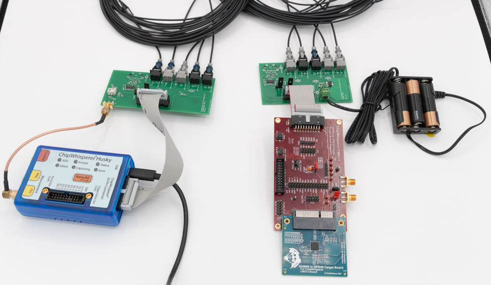
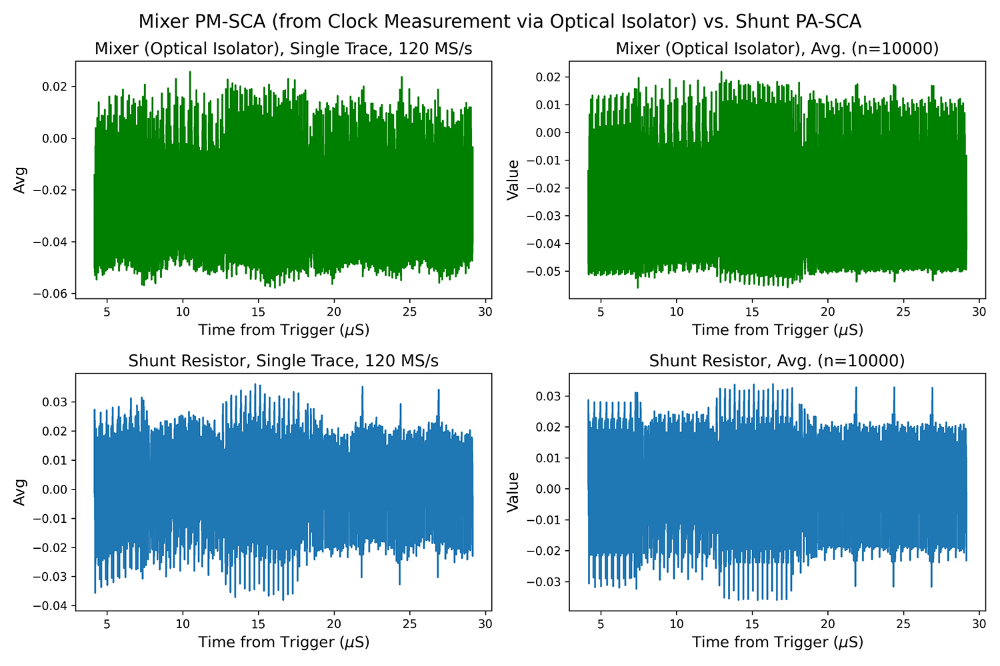
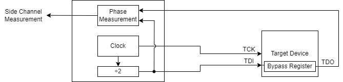
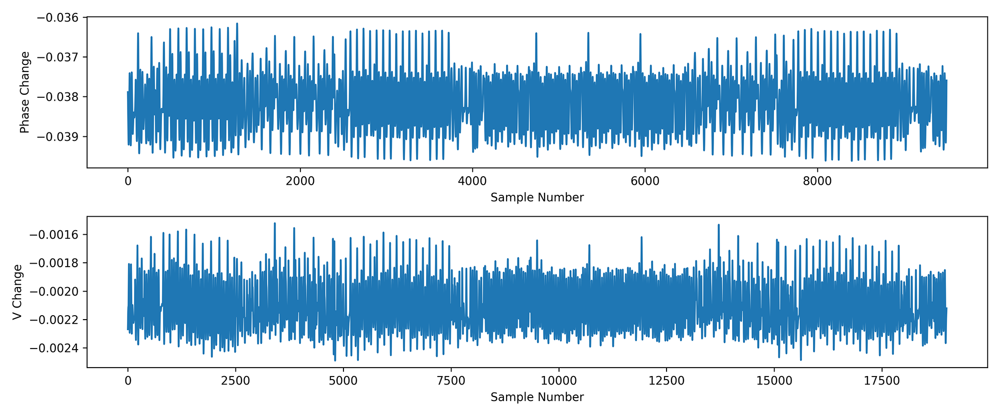

# Phase Moducation Side Channel Analysis and JTAG Attacks

This repository is a companion for the T-CHES Paper "Phase Modulation Side Channels: Jittery JTAG for On-Chip Voltage Measurements". You can see a current version on the [E-Print Server](https://eprint.iacr.org/2024/1107).

If referencing the paper, please reference the T-CHES publication. As the Volume 4 is not fully published, the following can be used until the full reference is available:

```
@article{PhaseModulationCO24,
    author=  {Colin O'Flynn},
    title =  {Phase Modulation Side Channels: Jittery JTAG for On-Chip Voltage Measurements},
    volume=  {2024},
    number=  {4},
    journal= {IACR Transactions on Cryptographic Hardware and Embedded Systems},
    year =   {2024}
}
```

## What's this Paper About?

The following is a very brief summary of the above paper:

### Phase Modulation Measurements

At CHES 2023, a paper entitled [JitSCA](https://tches.iacr.org/index.php/TCHES/article/view/10965) was presented. This paper presented the idea that because the propogation delay through a digital device depends on the voltage, a signal (such as a clock) transmitted from a digital device actually *encodes in the "jitter" of that clock the voltage supply*.

The paper in this repo expands on this to first demonstrate that we could call that a simple phase modulation. A demonstration board using isolators (both optical & ic-based are tested) is setup, which looks like this:



The point of this is that all analog signals (should) be removed, leaving only the timing (phase) information (NB: note similar tests were done in the JitSCA work, there are some extensions but this section is primarily confirming the prior work). Because this is all done using the ChipWhisperer hardware, we can easily compare a classic shunt-based measurement (using a normal analog signal) with our phase-based measurement (after the optical isolators). The top waveforms (in green) are using the optical isolator board, the bottom waveforms (in blue) are with a shunt resistor and ADC.



Visually it looks shockingly similar! The phase measurement based test only has optically isolated digital signals. In the paper I described a lot of comparisons done to confirm the leakage is present (and to also compare to prior I/O-pin leakage work).

It is also successful for a CPA attack, being only slightly noisier. You could use any clock source from the device, such as an uSD card SCLK line as the jitter source. But we can go further:

### JTAG Side Channel Measurements

The second part of the paper includes another idea: if we can use digital paths for side channels, why not use JTAG? JTAG contains a "bypass mode", which if we enable bypass mode lets us route a clock across the target. The setup is something like this:



Here is an example of a side channel trace measured with a JTAG port, again compared to the same target using a shunt resistor:



This has a few interesting results:

1) The JTAG port is often exposed, and it means an attacker doesn't need analog probes, just digital signals.
2) Many devices leave some JTAG functionality enabled - while debug and flash access (should) be turned off, boundary scan mode is often left on. Only certain devices even allow you to fully disable JTAG, on many devices it is always available.
3) The JTAG port can run a lot faster than the datasheet suggests, meaning you get pretty good sample rates.

### JTAG Fault Sensitivity Analysis

Another variation of this uses something called "fault sensitivity analysis". In this case we actually use the fact that if we adjust the timing of our signals such that faults are "about" to occur, we can measure the liklihood of faults at a given instance of time to again create analog (power-like) waveforms.

This is noisier and takes more traces, as you basically have a 1-bit ADC. But again, it is suprisingly effective.

## What's in the Repository?

The repository is a companion to the paper, and also includes all the code as well as hardware designs for the tools used.

More details of building the tools is forthcoming, but see the details in the paper for now.